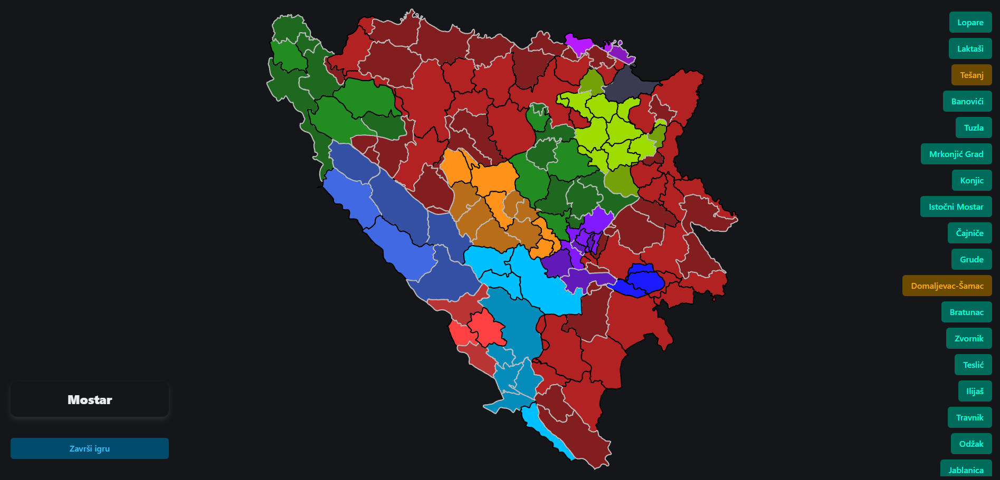

# 🗺️ Bosnia & Herzegovina Municipalities Quiz
### Map-based guessing game (Vanilla JS + Bulma)

A small web quiz game where you **guess municipalities of Bosnia and Herzegovina** using an interactive map. Built as a lightweight front-end project using **plain JavaScript** and **Bulma CSS** for styling.

---

## ✨ Features

- **Interactive municipality map** (SVG-based)
- **Guessing gameplay**: type/select a municipality and submit
- **Instant feedback** (correct/incorrect)
- **Score / progress tracking**
- Clean responsive UI with **Bulma**

---

## 🧩 Tech Stack

- **Vanilla JavaScript**
- **Bulma CSS**
- **HTML / CSS**
- **SVG map** for municipal boundaries

---

## 🎮 How to Play

https://bih-quiz-bulma-js.vercel.app/

---

  

